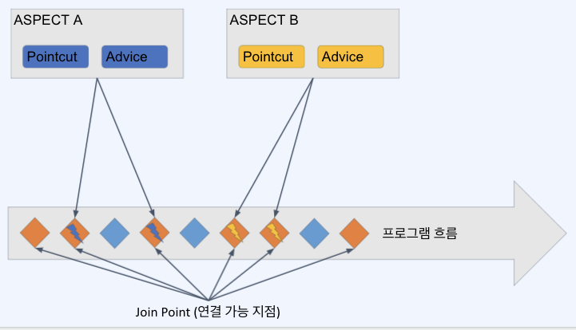

# AOP, Aspect Oriented Programming

특정한 함수 호출 전이나 후의 공통적인 처리에 사용된다. (로깅, 트랜잭션, 인증)ㅐ

## AOP의 기본 개념들



### Aspect

여러 클래스나 기능에 걸쳐서 있는 관심사, 그리고 그것들을 모듈화하는 것.\
가장 많이 활용되는 부분은 @Transactional 기능

### Advice

AOP에서 실제로 적용하는 기능 (로깅, 트랜잭션, 인증 등)

### Join point

Aspect 가 실행될 수 있는 연결 포인트

### Pointcut

Join point 중에서 Aspect 를 적용할 대상을 뽑을 조건식

### Target Object

Advice가 적용될 대상 오브젝트

### AOP Proxy

대상 오브젝트에 Aspect 를 적용하는 경우 Advice 를 덧붙이기 위해 하는 작업\
주로 CGLIB (Code Generation Library, 실행 중에 실시간으로 코드를 생성하는 라이브러리) 프록시를 사용하여 프록싱 처리를 한다.

### Weaving

Advice 를 비즈니스 로직 코드에 삽입하는 것.

## AspectJ

AOP를 제대로 사용하기 위해 꼭 필요한 라이브러리\
기본적으로 제공되는 Spring AOP 로는 다양한 기법의 AOP를 사용할 수 없음. (Pointcut 등)

### Aspect의 생성

```java
package org.xyz;
import org.aspectj.lang.annotation.Aspect;

@Aspect
@Component  // Component를 붙인 것은 해당 Aspect를 스프링의 Bean으로 등록해서 사용하기 위함
public class UsefulAspect {

}
```

### Pointcut 선언

```java
package org.xyz;
import org.aspectj.lang.annotation.Aspect;

@Aspect
@Component  // Component를 붙인 것은 해당 Aspect를 스프링의 Bean으로 등록해서 사용하기 위함
public class UsefulAspect {

	@Pointcut("execution(* transfer(..))")
	private void anyOldTransfer() {}
}
```

* 해당 Aspect의 Advice 가 적용될 Join point 를 찾기 위한 패턴 또는 조건 생성
* 포인트 컷 표현식이라고 부름

### Pointcut 결합

```java
package org.xyz;
import org.aspectj.lang.annotation.Aspect;

@Aspect
@Component  // Component를 붙인 것은 해당 Aspect를 스프링의 Bean으로 등록해서 사용하기 위함
public class UsefulAspect {

	@Pointcut("execution(public * *(..))")
	private void anyPublicOperation() {} //public 메서드 대상 포인트 컷

	@Pointcut("within(com.xyz.myapp.trading..*)")
	private void inTrading() {} // 특정 패키지 대상 포인트 컷
	
	@Pointcut("anyPublicOperation() && inTrading()")
	private void tradingOperation() {} // 위의 두 조건을 and(&&) 조건으로 결합한 포인트 컷
}
```

## Advice 정의

포인트 컷들을 활용하여 포인트컷의 전/후/주변에서 실행될 액션을 정의함

### Before Advice

dataAccessOperation() 이라는 미리 정의된 포인트 컷의 바로 전에 doAccessCheck() 가 실행

```java
import org.aspectj.lang.annotation.Aspect;
import org.aspectj.lang.annotation.Before;

@Aspect
public class BeforeExample {

    @Before("com.xyz.myapp.CommonPointcuts.dataAccessOperation()")
    public void doAccessCheck() {
        // ...
    }
}
```

### After Returning Advice

dataAccessOperation() 라는 미리 정의된 포인트컷에서 return 이 발생된 후 실행

```java
import org.aspectj.lang.annotation.Aspect;
import org.aspectj.lang.annotation.AfterReturning;

@Aspect
public class AfterReturningExample {

    @AfterReturning("com.xyz.myapp.CommonPointcuts.dataAccessOperation()")
    public void doAccessCheck() {
        // ...
    }
}
```

### Around Advice

businessService() 라는 포인트컷의 전/후에 필요한 동작을 추가함

```java
import org.aspectj.lang.annotation.Aspect;
import org.aspectj.lang.annotation.Around;
import org.aspectj.lang.ProceedingJoinPoint;

@Aspect
public class AroundExample {

    @Around("com.xyz.myapp.CommonPointcuts.businessService()")
    public Object doBasicProfiling(ProceedingJoinPoint pjp) throws Throwable {
        // start stopwatch
        Object retVal = pjp.proceed();
        // stop stopwatch
        return retVal;
    }
}
```
