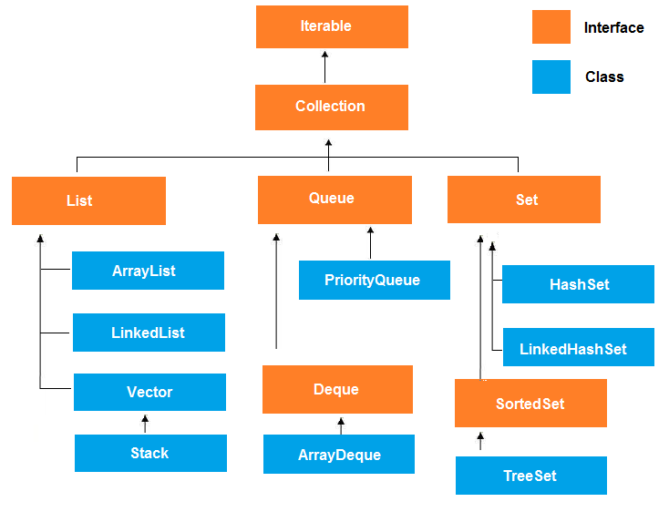

# 자료구조

| Interface  |       | Desc                            | 구현 클래스                                  |
| ---------- | ----- | ------------------------------- | --------------------------------------- |
| Collection | List  | 순서 보장, 중복 가능                    | ArrayList, Vector, LinkedList           |
|            | Set   | 순서를 보장 불가, 중복 불가                | HashSet, TreeSet                        |
|            | Queue | FIFO(First In First Out) 구조     | ArrayDeque, PriorityQueue               |
| Map        |       | Key 중복 불가, Key - Value 를 쌍으로 저장 | HashMap, HashTable, TreeMap, Properties |

#### TreeMap vs HashMap

|                        |      HashMap     |          TreeMap          |
| ---------------------- | :--------------: | :-----------------------: |
| Extends Implementation | AbstractMap, Map | AbstractMap, NavigableMap |
| Null Key               |        Yes       |             No            |
| Multiple Null Values   |        Yes       |            Yes            |
| \<Key, Value> Order    |        No        |      Natural Ordering     |
| Synchronized           |        No        |             No            |
| Complexity             |       O(1)       |          O(logN)          |

* HashMap 의 capacity (bucket) 이 충분히 커지는 경우 TreeMap 과 유사한 상태가 됩니다.
  * 공간배치를 다시하는 rehashing 을 할 수 있지만 큰 부하가 걸립니다.
* TreeMap 이 NullKey 를 가질 수 없는 이유
  * Key 가 Null 이면 ordering 시 NullPointerException 이 발생합니다.

#### LinkedHashMap

순서가 보장되는 HashMap

* LinkedHashMap (int initialCapacity, float loadFactor, boolean accessOrder)
  * (저장된 데이터의 수 > capacity \* load\_factor) 가 되면 rehasing 가 수행됩니다.
  * boolean accessOrder
    * true : 접근이 적은 순서대로 저장됩니다. (access-order)
    * false : 입력한 순서대로 저장됩니다. (insertion-order)
* removeEldestEntry (Map.Entry\<K,V> eldest)
  * 생성자의 accessOrder 값에 따라 가장 오래된 \<K,V> 를 삭제 합니다.
* getOrDefault(Object key, V defaultValue)
  * Optional 을 대신할 수 있는 메소드로 key 를 찾지 못할 경우 defaultValue 를 리턴합니다.
