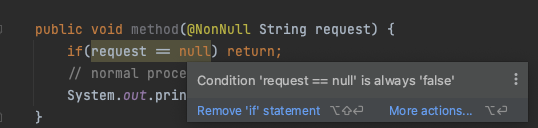
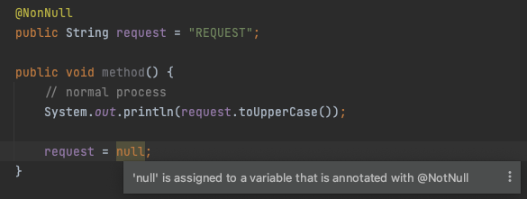
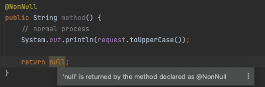
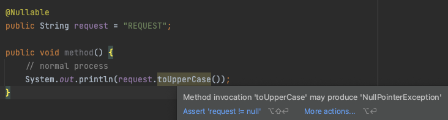

# Null Safety

널 안정성을 높이는 방법

* 아래와 같은 코드를 만들지 않는 방법
* 혹은 아래와 같은 널 체크를 하지 않아서 발생하는 NPE 를 (Null Pointer Exception) 방지하는 방법
* 완벽한 방법은 아니지만 IDE 에서 경고를 표시함으로써 1차적인 문제를 방지하고, 정확한 에러 위치를 확인할 수 있도록 도움

```java
public void method(String request) {
	if(request == null) return;

	// normal process
	System.out.println(request.toUpperCase());
}
```

## @NonNull Annotation

* 해당 값이나 함수 등이 Null 이 아님을 나타내는 어노테이션
* org.springframework.lang.NonNull 사용
* 메서드 파라미터에 붙이는 경우: null 이 들어오는 것을 사전에 방지함 
* 프로퍼티에 붙이는 경우: null 을 저장하는 경우 경고\
  
* 메서드에 붙이는 경우: null 을 리턴하는 경우 경고, 응답값을 저장하거나 활용하는 쪽도 NonNull 이라고 신뢰하고 사용\
  

## @Nullable Annotation

* @NonNull 과 반대로 해당 데이터가 null 일 수 있음을 명시함
* 해당 어노테이션이 붙은 값을 사용하는 경우 null check 를 항상 수행하도록 경고


