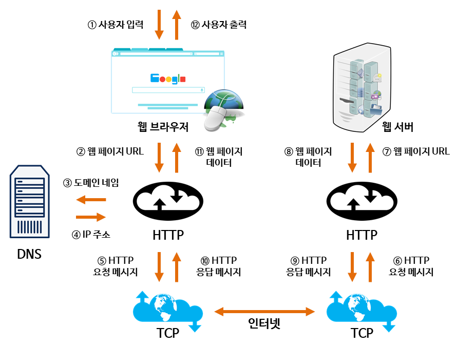
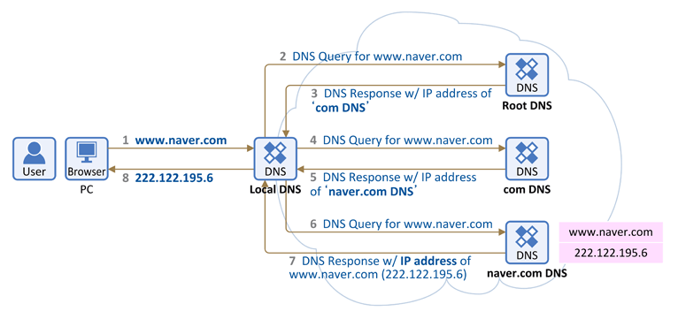

# 인터넷의 작동 원리

## DNS (Domain Name System) 탐색 과정

DNS 란 사람이 읽을 수 있는 도메인 이름을 머신이 읽을 수 있는 IP 주소로 변환해주는 시스템을 말합니다. (www.amazon.com -> 192.0.2.44)

* Root DNS 는 전 세계에 13 대가 구축되어 있고, 우리나라에는 3 대의 미러 서버가 있습니다.
* Local DNS 서버가 여러 DNS 서버를 차례대로 순회하며 (Root DNS -> com DNS -> naver.com DNS) 답을 찾는 과정을 Recursive Query 라고 부릅니다.
* 수신된 IP 는 Local DNS 에 캐싱되고 PC 로 전달됩니다.
* host 파일에 IP 를 기재하면 DNS 를 거치지 않습니다.
