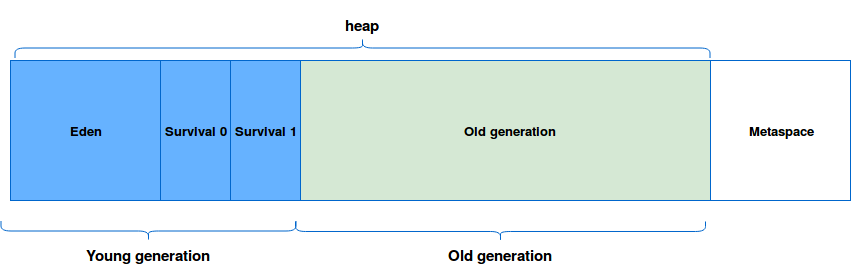

# Garbage Collection

JVM 의 Garbage Collector 가 Unreachable Object 를 메모리에서 제거하여 공간을 확보하는 것

#### stop the world

* GC 를 실행하기 위해 JVM 이 애플리케이션의 작동을 멈추는 것으로 어떤 GC 알고리즘이라도 stop the world 는 발생합니다.
* stop the world 가 발생하면 GC 를 실행하는 쓰레드를 제외한 모든 쓰레드는 모두 작업을 멈춥니다.
* 대개의 경우 GC 튜닝이란 이 stop the world 시간을 줄이는 것 입니다.

#### System.gc()

명시적으로 가비지 컬렉션이 일어나게 하지만, 모든 스레드가 중단되기 때문에 코드를 통한 호출은 권장되지 않습니다.

### Garbage Collection 과정

#### Mark Sweep Compaction

* Mark
  * JVM 의 Garbage Collector 가 스택의 모든 변수를 스캔하면서 각각 어떤 오브젝트를 레퍼런스 하고 있는지 찾는 과정
  * reachable 오브젝트가 레퍼런스하고 있는 오브젝트를 marking 합니다.
  * 모든 스레드의 작업이 중단됩니다. (stop the world)
* Sweep
  * mark 되어있지 않은 모든 오브젝트를 힙에서 제거하는 과정
  * Garbage Collection 이라고 하면 garbage 들을 수집할 것 같지만 실제로는 garbage 가 아닌 것을 따로 mark 하고 그 외의 것은 모두 지웁니다.
* Compact
  * sweep 단계 후 살아남은 객체들 사이사이의 빈 공간을 채우고 참조를 업데이트하는 과정에서 overhead 가 발생합니다.

#### Heap Garbage Collection

* MinorGC: Young Generation 에서 발생하는 GC
* MajorGC: Old Generation (Tenured Space) 에서 발생하는 GC
* FullGC: heap 전체를 clear 하는 작업 (young/old 공간 모두)
* Metaspace: java 1.8 이후 Permanent Generation 에서 변경된 명칭입니다. static 변수, 상수가 heap 으로 이동했습니다.

1. 새로운 오브젝트는 Eden 에 할당되고, 두 개의 Survivor Space 는 비워진 상태로 시작합니다.
2. Eden 이 가득차면, MinorGC 가 발생합니다.
   1. reachable 오브젝트들은 S0 으로 옮겨지고 Eden 은 클리어됩니다. 이때 unreachable 오브젝트들도 같이 사라집니다.
   2. 기존 S0 에 있었던 reachable 오브젝트들은 S1 으로 옮겨지고, 이때 age 값이 증가되어 옮겨집니다.
   3. Young Generation 에서 계속해서 살아남아 age 값이 특정 값 이상된 오브젝트는 Old Generation 으로 옮겨집니다. (Promotion)
3. Promotion 작업이 계속되서 Old Generation 이 가득차면 MajorGC 가 발생합니다.

### Garbage Collector 종류

#### Serial GC `-XX:+UseSerialGC`

* Java SE 5, 6 에서 사용되는 디폴트 가비지 컬렉터
* 적은 메모리와 CPU 코어 개수가 적을 때 적합한 방식
* MinorGC, MajorGC 모두 순차적으로 시행되며 Mark-Compact collection method 를 사용합니다.
  * Mark-Compact collection method: 메모리에 있는 오브젝트들을 heap 의 시작 위치로 옮겨 놓는 방법

#### Parallel GC (Throughput GC) `-XX:+UseParallelGC`

* 가비지 컬렉션 수행시 멀티스레드를 사용하는 가비지 컬렉터 (기본 Young Generation)
* 단 호스트 머신이 싱글 CPU 라면 디폴트 가비지 컬렉터 (Serial GC) 가 사용됩니다.
* `-XX:+UseParallelOldGC` 옵션을 사용하면, Old Generation 의 가비지 컬렉션에서도 멀티스레드를 활용할 수 있습니다.
  * JDK 5 update 6 부터 사용 가능

#### CMS Collector (Concurrent Mark Sweep Collector, Low Latency GC) `-XX:+UseConcMarkSweepGC`

* 대부분의 가비지 컬렉션 작업을 애플리케이션 스레드와 동시에 수행함으로써 가비지 컬렉션으로 인한 stop the world 를 최소화하는 가비지 컬렉터
* Young Generation 에 대한 가비지 컬렉션시 Parallel GC 와 같은 알고리즘을 사용하는데, `-XX:ParallelCMSThreads={n}` 옵션으로 스레드 개수를 설정할 수 있습니다.
* 단점
  * 메모리와 CPU 사용량이 높습니다.
  * 일반적으로 compaction 작업을 수행하지 않음으로 메모리 파편화의 문제가 있습니다. (더 큰 힙사이즈 할당)

#### G1 Garbage Collector `-XX:+UseG1GC`

* 발전하는 하드웨어 스펙에 따라 이전의 가비지 컬렉터가 적합하지 않아 나온 가비지 컬렉터
* 큰 heap 메모리에서 짧은 GC 시간을 보장하는데 목적이 있습니다.
* 기존의 고정된 크기, 위치가 아닌 전체 Heap 영역을 Region 이라는 특정한 크기로 나눠 동적으로 역할을 (Eden, Survivor, Old) 부여합니다.
