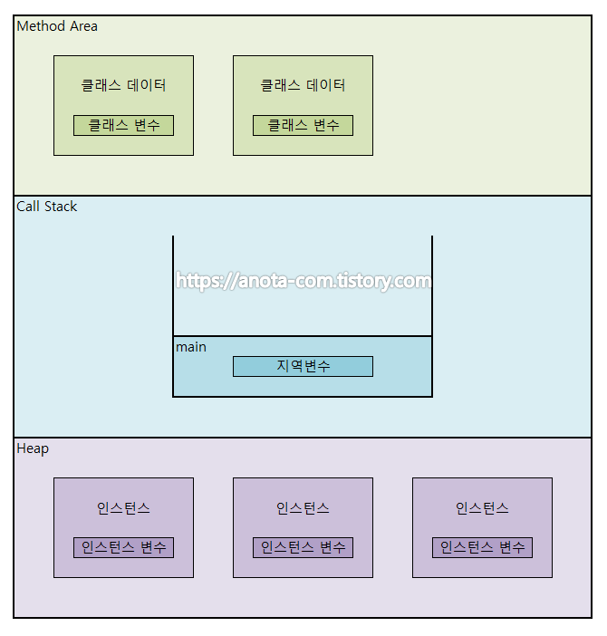

# 메모리 관리

자바 애플리케이션은 JVM (Java Virtual Machine) 위에서 돌아가며 JVM 은 프로그램 실행동안 메모리를 관리해줍니다.

### 메모리 구조

#### Method

메소드 영역은 자바 프로그램에서 사용되는 클래스에 대한 정보와 함께 클래스 변수 (static variable)가 저장되는 영역입니다. JVM은 자바 프로그램에서 특정 클래스가 사용되면 해당 클래스의 클래스 파일 (\*.class)를 읽어들여, 해당 클래스에 대한 정보를 메소드 영역에 저장합니다.

#### Stack

자바 프로그램에서 메소드가 호출될 때 메소드의 스택 프레임이 저장되는 영역입니다.

* heap 영역에 생성된 object 타입의 데이터의 참조 값이 할당됩니다.
* primitive 타입의 데이터는 값과 함께 할당됩니다.
* 지역변수들은 scope 에 따른 visibility 를 가집니다.
* 각 thread 는 자신만의 stack 을 가집니다.

#### Heap

자바 프로그램에서 사용되는 모든 인스턴스 변수가 저장되는 영역입니다.

* heap 영역에는 주로 긴 생명주기를 가지는 데이터들이 저장됩니다.
  * 오브젝트는 크기가 크고, 서로 다른 코드 블럭에서 공유되는 경우가 많습니다.
* stack 에 있는 데이터를 제외한 부분이라고 봐도 됩니다.
* 모든 object 타입 (Integer, String, ArrayList, ...) 은 heap 영역에 생성됩니다.
* 몇 개의 스레드가 존재하든 상관없이 하나의 heap 영역만 존재합니다.
* heap 영역에 있는 오브젝트들을 가리키는 참조 값은 stack 에 있습니다.
